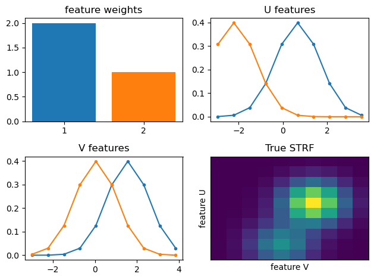
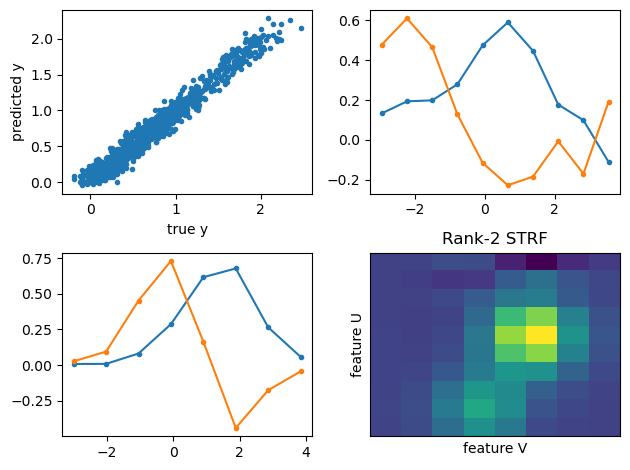
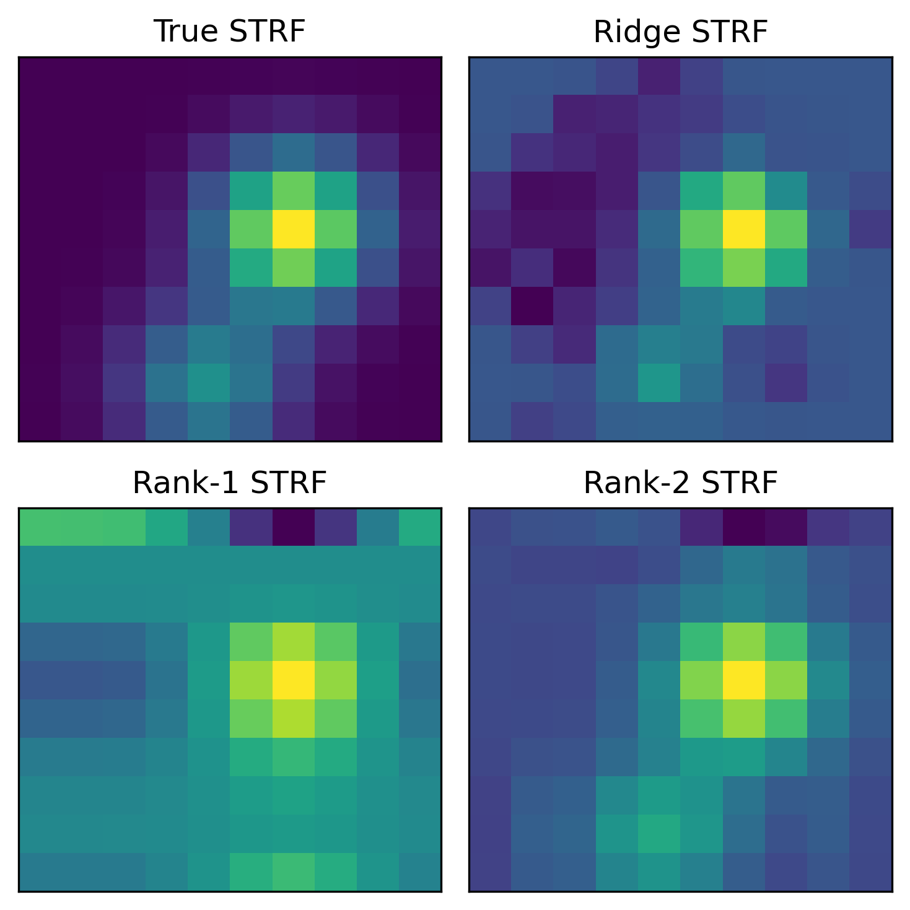

# Low-rank Regression

## Overview

Suppose you have 2D covariates $X \in \mathbb{R}^{L \times M}$, and observations $y \in \mathbb{R}$, and you would like to find weights $W \in \mathbb{R}^{L \times M}$ where:

$$ y \approx \sum_{ij} X_{ij} W_{ij} + \epsilon $$ 

where $\epsilon$ is Gaussian noise.

One possibility is that $W$ is low-rank, meaning it can be written as $W = U S V^\top$, where $U \in \mathbb{R}^{L \times K}$, $V \in \mathbb{R}^{M \times K}$, and $S$ is a diagonal matrix, for some rank $K$. For example, if $W$ is rank-1, it can be written as $W = \boldsymbol{u} s \boldsymbol{v}^\top$ for vectors $u$ and $v$.

This code will perform low-rank linear regression for this setting.

__Note: This is distinct from Reduced Rank Regression, which is when we have $Y$, a vector of observations, rather than a scalar $y$, as we do here.__

## Simulations

To illustrate, below we sample data using a constructed W which is rank-2:

W, or the "STRF", is the outer product of the vectors in U and V.

We then use the resulting simulated data to estimate W using Rank-2 regression:

We can compare the estimated weights using Ridge, Rank-1, and Rank-2 regression:

Note that the Ridge regression can also fit the data well, but the resulting weights are _not_ low rank.
